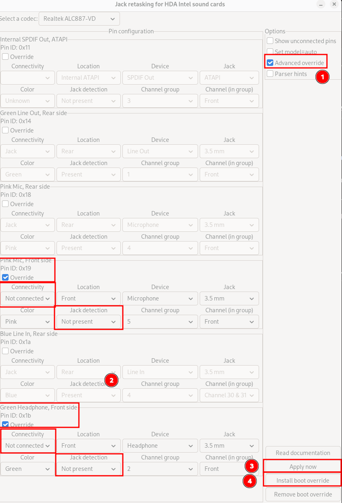

# Fixing Random Audio Popping on Linux (Realtek ALC887-VD, AMD Family 17h)

I ran into an annoying audio issue on my desktop PC running Debian 13 with
GNOME. Actually the problem is actually independent from the distro, desktop
environment or the kernel. I experienced the same problem on the same hardware
over years with different distros. The problem was so annoying so that on Linux
I have been using the sound output of my monitor over Display Port or HDMI.

The onboard audio (**Realtek ALC887-VD** codec on an **AMD Family 17h** chipset)
kept **popping**, and in GNOME the output device would **disappear and reappear
for a split second.** Audio never fully stopped, but the random pop + device
flicker made the system frustrating to use.

The same hardware worked perfectly under Windows, so I focused on Linux-side
debugging.

## Symptoms

- Random popping / clicking sounds during playback
- GNOME sound output device briefly disappearing
- No useful logs in `dmesg`, `journalctl`, PipeWire, or WirePlumber
- Problem looks independent from CPU load. Higher load doesn't mean more
  frequent popping
- `aplay -l` always stable (ALSA still sees the device)

This looked like momentary device resets but without any kernel error messages.
Since it is independent from CPU load and works fine on Windows, it shouldn't be
related to a "real" hardware problem or a DMA issue (?).

## Fixes That Did Not Solve the Issue

Many posts on the internet and LLMs (like ChatGPT) suggests tweaking the power
saving options but those ones didn't work for me.

## Root Cause: Faulty Front Panel Jack Detection

This Reddit post solved my problem:

<https://www.reddit.com/r/linux4noobs/comments/1ahghh9/realtek_alc887vd_audio_chipset_crackles_in_linux/>

After a lot of checking, the real cause turned out to be **broken or noisy front
panel jack detection.**

Here is my 2 cents: Some Realtek codecs (including ALC887-VD) continuously poll
the front jack pins. If the case wiring is low quality or noisy, the codec
falsely detects a "jack plugged/unplugged" event which causes PipeWire to
recreate the node and GNOME to briefly flash the volume popup. Not sure why this
isn't a problem on Windows, may be a difference in a driver or a configuration?

## Working Solution: Disable Front Panel Jacks Using HDAJackRetask

On Debian based distro, first install **HDAJackRetask**

```shell
sudo apt install alsa-tools-gui
```

then run

```shell
hdajackretask
```

Now, according to the Reddit post apply the following settings. I am using
the back green output jack for my speaker and not using the front panel, the
shown settings are fine for me



Open `Advanced override`, do the necessary settings. First click `Apply now`
button. This solved my issue immediately without rebooting. If you are happy,
then `Install boot override` to make it permanent. If you are curious then start
analyzing from `/etc/modprobe.d/hda-jack-retask.conf`
